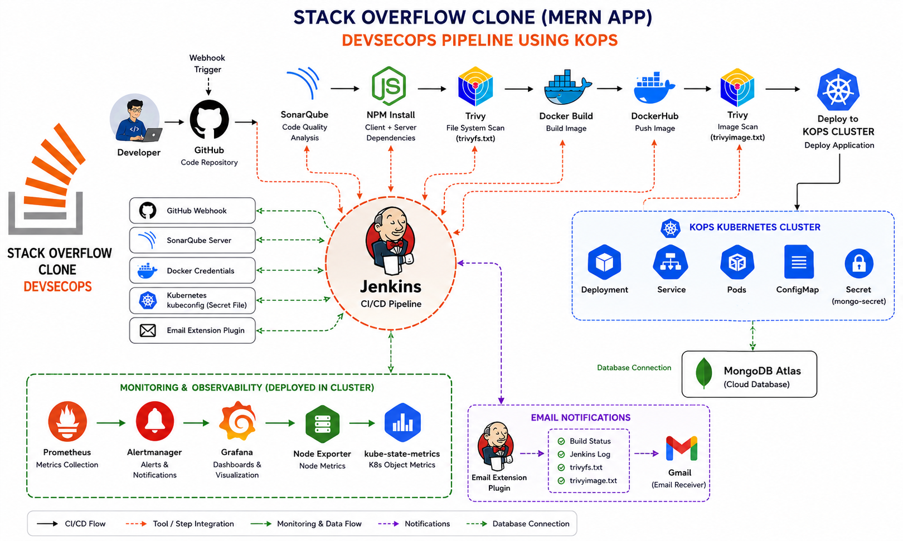

# 🚀 Stack Overflow Clone DevSecOps Project

## 📌 Project Overview

This project demonstrates a complete **DevSecOps CI/CD Pipeline** for deploying a **Stack Overflow Clone MERN Application** using modern DevOps, Security, Containerization, Kubernetes, and Cloud technologies.

The project integrates **GitHub, Jenkins, SonarQube, Trivy, Docker, KOPS, Kubernetes, Prometheus, Grafana, and MongoDB Atlas** to implement an end-to-end automated deployment pipeline.

---

# 🏗️ DevSecOps Architecture

Developer → GitHub → Jenkins → SonarQube → Quality Gate → Trivy → Docker → DockerHub → KOPS Kubernetes Cluster → Prometheus → Grafana



---

# 🖥️ Application Preview

A modern Stack Overflow Clone built using:

### Frontend

* React.js
* Redux
* Axios
* React Router DOM
* CSS

### Backend

* Node.js
* Express.js
* JWT Authentication
* Mongoose

### Database

* MongoDB Atlas

---

# 🔧 Project Integrations

* CI/CD Automation
* Security Scanning
* Docker Containerization
* Kubernetes Deployment
* KOPS Cluster on AWS
* Monitoring & Observability
* Email Notifications
* MongoDB Atlas Integration

---

# 🚀 DevSecOps Tools Used

* GitHub
* Jenkins
* SonarQube
* OWASP Dependency Check
* Trivy
* Docker
* DockerHub
* Kubernetes
* KOPS
* Prometheus
* Grafana
* Alertmanager
* Node Exporter
* kube-state-metrics
* MongoDB Atlas

---

# 🎯 Features

* User Authentication
* JWT Authorization
* Ask Questions
* Answer Questions
* Vote Questions
* User Profiles
* MongoDB Atlas Integration
* CI/CD Pipeline Automation
* Security Scanning
* Dockerized Deployment
* Kubernetes Deployment using KOPS
* Monitoring with Prometheus & Grafana
* Automated Email Notifications

---

# ⚙️ Local Setup

## Clone Repository

```bash
git clone https://github.com/vicky9168/stackflow-devsecops.git

cd stackflow-devsecops
```

---

## Install Frontend Dependencies

```bash
cd client

npm install
```

---

## Install Backend Dependencies

```bash
cd ../server

npm install
```

---

## Configure Environment Variables

Create a `.env` file inside the `server` directory.

```env
PORT=5000

CONNECTION_URL=your_mongodb_connection_string

JWT_SECRET=your_jwt_secret
```

---

## Run Backend Server

```bash
cd server

npm start
```

Backend runs on:

```text
http://localhost:5000
```

---

## Run Frontend

Open another terminal:

```bash
cd client

npm start
```

Frontend runs on:

```text
http://localhost:3000
```

---

# ⚙️ CI/CD Pipeline Stages

| Stage                  | Description                        |
| ---------------------- | ---------------------------------- |
| Clean Workspace        | Clean Jenkins workspace            |
| Checkout Code          | Pull source code from GitHub       |
| SonarQube Analysis     | Static code analysis               |
| Quality Gate           | Validate code quality              |
| Install Dependencies   | Install npm packages               |
| OWASP Dependency Check | Dependency vulnerability scan      |
| Trivy FS Scan          | File system vulnerability scan     |
| Docker Build & Push    | Build and push Docker image        |
| Trivy Image Scan       | Scan Docker image                  |
| Deploy to Kubernetes   | Deploy application to KOPS Cluster |
| Monitoring Setup       | Prometheus & Grafana               |
| Email Notification     | Build status and scan reports      |

---

# 🔐 Security Scanning

## SonarQube

Checks:

* Bugs
* Vulnerabilities
* Code Smells
* Security Hotspots
* Duplicate Code

---

## OWASP Dependency Check

Checks:

* Vulnerable Dependencies
* CVEs
* Dependency Risks

---

## Trivy

### File System Scan

* Source Code Vulnerabilities
* Secrets Detection

### Docker Image Scan

* OS Vulnerabilities
* Package Vulnerabilities
* Security Risks

---

# 🐳 Docker Deployment

Build Docker Image

```bash
docker build -t vickydockek11/stackflow:latest .
```

Run Container

```bash
docker run -d --name stackflow -p 80:5000 vickydockek11/stackflow:latest
```

---

# ☸️ Kubernetes Deployment

Deploy Resources

```bash
kubectl apply -f k8s/deployment.yml

kubectl apply -f k8s/service.yml
```

Verify Resources

```bash
kubectl get pods

kubectl get svc

kubectl get deployments
```

---

# ☁️ KOPS Kubernetes Deployment

The application is deployed on a Kubernetes cluster created using KOPS.

Deployment Includes:

* KOPS Kubernetes Cluster
* Calico Networking
* Kubernetes Deployment
* Kubernetes Service
* MongoDB Atlas Integration
* DockerHub Images
* Kubernetes Secrets
* Jenkins CI/CD Integration

---

# 📊 Monitoring Setup

## Prometheus

Used For:

* Kubernetes Monitoring
* Node Monitoring
* Metrics Collection
* Cluster Health Monitoring

---

## Grafana

Used For:

* Dashboard Visualization
* CPU Monitoring
* Memory Monitoring
* Pod Monitoring
* Cluster Monitoring

---

## Alertmanager

Used For:

* Alert Management
* Notifications
* Incident Monitoring

---

## Node Exporter

Used For:

* Node-Level Metrics
* CPU Metrics
* Memory Metrics
* Disk Usage Metrics

---

# 📧 Email Notifications

Jenkins automatically sends build notifications containing:

* Build Status
* Jenkins Build Log
* Trivy File System Scan Report (`trivyfs.txt`)
* Trivy Image Scan Report (`trivyimage.txt`)

---

# 🌐 Application Access

After successful deployment, verify that the Kubernetes service is running:

```bash
kubectl get svc
```

Copy the External LoadBalancer URL and open it in your browser:

```text
http://<load-balancer-url>
```

You should now be able to access the Stack Overflow Clone application.

---

# 📚 Detailed Setup Guide

For detailed installation, Jenkins configuration, KOPS cluster creation, Kubernetes deployment, monitoring setup, and troubleshooting instructions, refer to:

```text
Steps.txt
```

---
